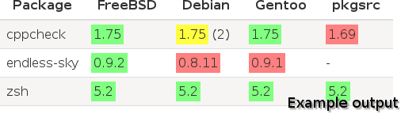

# Repology

[](https://travis-ci.org/repology/repology)
[](https://coveralls.io/github/repology/repology?branch=master)
[](https://landscape.io/github/repology/repology/master)



Repology tracks and compares package versions along multiple
repositories including Arch, Chocolatey, Debian, Fedora, FreeBSD,
Gentoo, Mageia, OpenBSD, OpenSUSE, pkgsrc, Sisyphus, SlackBuilds,
Ubuntu and more.

## Uses

- **Users**:
  - Compare completeness and freshness of package repositories,
    choose most up to date distro
  - Find out what repositories contain newest versions of packages
    you need
- **Package/port maintainers**:
  - Another way to track new releases of software you package
  - Compete with other distros in keeping up to date
  - Find fellow maintainers to resolve packaging problems together
  - Keep package naming and versioning schemes in sync to other
    repos for your and your user's convenience
- **Software authors**:
  - Keep track of how well your project is packaged
  - Keep in touch with your product package maintainers
  - If you're not using [semantic versioning](http://semver.org/)
    yet, see how useful it is

## Status

Repology is currently in an early phase of development, with a goal
of creating usable utility in a quick and dirty way. For now, it is
usable in two modes: as a command line generator of single HTML
report and a static website generator for [repology.org](https://repology.org).

## Repository support

As much data as possible is parsed from each repo. Package name and
version are always parsed.

| Repository                       | Summary | Maint-r | Categ | WWW   | License | Download |
|----------------------------------|:-------:|:-------:|:-----:|:-----:|:-------:|:--------:|
| Alpine                           | ✔       | ✔       |       | ✔     | ✔       |          |
| ALT Sisyphus                     | ✔       | ✔       | ✔     |       |         |          |
| Arch, Parabola, Manjaro          | ✔       | ✔       |       | ✔     | ✔       |          |
| CentOS, Fedora, Mageia, OpenSUSE | ✔       |         | ✔     | ✔     | ✔       |          |
| Chocolatey                       | ✔       |         |       | ✔     |         |          |
| CPAN                             |         | ✔       |       | ✔ (2) |         |          |
| CRAN                             |         |         |       | ✔ (2) |         |          |
| CRUX                             | ✔       | ✔       |       | ✔     |         |          |
| Debian, Ubuntu, other deb-based  |         | ✔       | ✔     | ✔     |         |          |
| DistroWatch.com                  | ✔       |         |       | ✔     |         | ✔        |
| F-Droid                          |         |         | ✔     | ✔     | ✔       |          |
| FreeBSD                          | ✔       | ✔       | ✔     | ✔     |         |          |
| freshcode.club                   | ✔       |         |       | ✔     | ✔       |          |
| Gentoo                           | ✔       | ✔       | ✔     | ✔     | ✔ (1)   | ✔ (1)    |
| Guix                             | ✔       |         |       | ✔     | ✔       |          |
| GoboLinux                        | ✔       |         |       | ✔     | ✔       |          |
| Hackage                          |         |         |       | ✔ (2) |         |          |
| HaikuPorts                       |         |         | ✔     |       |         |          |
| Homebrew                         | ✔       |         |       | ✔     |         |          |
| MacPorts                         | ✔       | ✔       | ✔     | ✔     | ✔       |          |
| nixpkgs                          | ✔       | ✔       |       | ✔     | ✔       |          |
| OpenBSD                          | ✔       | ✔       | ✔     |       |         |          |
| OpenIndiana                      | ✔       |         | ✔     | ✔     |         | ✔        |
| PCLinuxOS                        | ✔       | ✔       | ✔     |       |         |          |
| pkgsrc                           | ✔       | ✔       | ✔     |       |         |          |
| PyPi                             | ✔       |         |       | ✔ (2) |         |          |
| Ravenports                       | ✔       |         | ✔     | ✔     |         |          |
| RubyGems                         |         |         |       | ✔ (2) |         |          |
| SlackBuilds                      |         | ✔       | ✔     | ✔     |         | ✔        |
| YACP                             |         |         |       |       |         |          |

(1) Gentoo support is not complete, complex cases like condional downloads and licenses
are ignored for now.

(2) WWWs are autogenerated for upstream package repos like CPAN, PyPi and Hackage

## Reading the report

Report is HTML table, columns correspond to repositories and rows
correspond to packages. Cells hold package versions, highlighted
as follows:

- ```cyan```: package is only present in a single repo: nothing to
              compare version to, and may be local artifact
- ```green```: package up to date
- ```red```: package outdated (there's newer version in some other repo)
- ```yellow```: there are multiple packages some of which are up to date
                and others are outdated
- ```gray```: version was manually ignored, likely because of broken
              versioning scheme

Note that there may be multiple packages of a same name in a single repo
(either naturally, or because of name transformations).

## Documentation

- How to [run](docs/RUNNING.md) repology tools on your own
- How to extend or fix [rules](docs/RULES.md) for package matching
- How repology [compares versions](https://github.com/repology/libversion/blob/master/doc/ALGORITHM.md)

## Author

* [Dmitry Marakasov](https://github.com/AMDmi3) <amdmi3@amdmi3.ru>

## License

GPLv3 or later, see [COPYING](COPYING).
